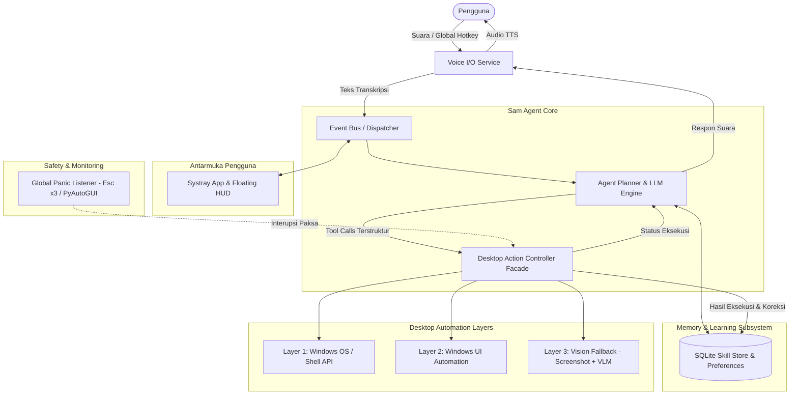

# Spesifikasi Desain: Sam-Desk-Agent

**Tanggal:** 2026-09-06  
**Status:** Draf Tervalidasi  
**Target Platform:** Windows 10 / 11 (64-bit)  
**Bahasa Pemrograman:** Python 3.10+  

---

## 1. Ringkasan Eksekutif & Tujuan Sistem

**Sam-Desk-Agent** adalah asisten desktop cerdas berbasis kecerdasan buatan (AI) yang berjalan di latar belakang (System Tray Windows) dan dikendalikan sepenuhnya melalui perintah suara (*Voice-Driven*). Agen ini mampu mengoperasikan komputer Windows layaknya remote desktop otomatis—mulai dari meluncurkan dan menutup program, mengetik teks, menggerakkan mouse, menggambar kanvas, mengontrol volume sistem, melakukan riset di internet, hingga belajar mandiri (*self-learning*) dan mengingat preferensi pengguna.

### Tujuan Utama (Goals):
1. **Hands-Free Desktop Control**: Mengontrol fungsi sistem, jendela, dan aplikasi desktop menggunakan perintah suara dalam Bahasa Indonesia atau Inggris.
2. **Smart Layered Execution**: Mengeksekusi tugas secara cepat melalui perintah sistem langsung (*Win32/Shell API*) bila memungkinkan, dan secara cerdas berpindah ke *UI Automation* serta *Vision-based Mouse/Keyboard* ketika menghadapi antarmuka visual dinamis.
3. **Multi-Step Tool Chaining**: Mampu mengeksekusi instruksi majemuk (misal: *"buka notepad, cari resep nasi goreng di internet, lalu ketikkan"*).
4. **Memory & Self-Learning**: Menyimpan resep alur kerja yang berhasil dan mengingat koreksi pengguna agar eksekusi berikutnya lebih instan dan presisi tanpa membuang kuota token.
5. **Absolute Safety**: Memiliki pengaman interupsi instan (*Panic Kill-Switch*) agar kendali mouse dan keyboard tidak lepas kendali.

---

## 2. Arsitektur Sistem Tingkat Tinggi

Sistem dirancang dengan pola *Modular Event-Driven Architecture* menggunakan bus komunikasi asinkron (`EventBus`).



---

## 3. Komponen Sistem & Dekomposisi Modul

### 3.1 Voice I/O Service (`src/voice/`)
Bertanggung jawab atas penangkapan input suara, transkripsi teks, dan sintesis audio balasan:
* **Audio Capture (`recorder.py`)**: Menggunakan `sounddevice` dan `numpy` dengan buffering audio dan Voice Activity Detection (VAD).
* **Push-to-Talk & Hotkey (`hotkey.py`)**: Menggunakan listener global `pynput` untuk mendeteksi penekanan tombol hotkey (default: `Alt + Space` atau `Ctrl + Shift + S`) serta pendeteksian opsional wake-word (`"Hey Sam"`).
* **Speech-to-Text (`stt_engine.py`)**: Menjalankan `faster-whisper` secara lokal (model `base` / `small` terkuantisasi `int8`). Ringan (<200MB RAM) dengan latensi transkripsi 200–400 milidetik.
* **Text-to-Speech (`tts_engine.py`)**: Menggunakan `edge-tts` (Microsoft Neural Voices Bahasa Indonesia: `id-ID-ArdiNeural` atau `id-ID-GadisNeural`) yang dialirkan ke pemutar audio lokal tanpa membebani GPU.

### 3.2 Agent Brain & Tool Calling Engine (`src/brain/`)
Bertindak sebagai pusat penalaran, perencanaan, dan orkestrasi alat:
* **LLM Client (`agent.py`)**: Berkomunikasi dengan Gemini 2.5 Flash atau OpenAI GPT-4o menggunakan *Structured Tool Calling*.
* **Tool Registry (`registry.py`)**: Mendefinisikan schema JSON untuk semua tool yang tersedia bagi agen.
* **Prompt Engine (`prompts.py`)**: System prompt yang memandu persona Sam, aturan dekomposisi langkah, dan panduan memilih layer eksekusi yang paling hemat biaya & cepat.

### 3.3 Unified Desktop Controller Facade (`src/desktop/`)
Menyediakan satu antarmuka terpadu bagi LLM untuk memanipulasi desktop Windows:
* **Layer 1: OS Actions (`os_actions.py`)**:
  * Menggunakan `psutil`, `pywin32` (`win32gui`, `win32con`, `win32process`), dan `subprocess`.
  * Menjalankan: `launch_app`, `close_app`, `focus_window`, `minimize_all`, `set_volume` (via `pycaw`), `media_control`.
* **Layer 2: UI Automation (`uia_actions.py`)**:
  * Menggunakan `pywinauto` untuk membaca *Windows Accessibility / UI Automation tree*.
  * Menjalankan klik tombol berdasarkan nama label (`click_button_by_name`), memilih tab, atau membaca teks jendela secara deterministik.
* **Layer 3: Vision Fallback (`vision_actions.py`)**:
  * Menggunakan `mss` untuk menangkap screenshot berkecepatan tinggi (<15 milidetik).
  * Mengirim gambar ke Multimodal VLM untuk mendapatkan koordinat target `(x, y)`.
  * Koordinat dinormalisasi (0–1000) dan disesuaikan dengan DPI awareness monitor aktif.
* **Mouse & Keyboard (`mouse_keyboard.py`)**:
  * Menggunakan `pyautogui`, `pynput`, dan `pyperclip`.
  * Menjalankan: `click_at`, `drag_and_drop` (misal menggambar kotak di Paint), `type_text`, dan `paste_text` instan untuk teks panjang.

### 3.4 Memory & Self-Learning Subsystem (`src/memory/`)
Memberikan persistensi kognitif dan efisiensi jangka panjang:
* **Database (`db.py`)**: SQLite lokal tersimpan di direktori pengguna (`~/.sam-agent/sam_memory.db`).
* **Profile Memory**: Menyimpan preferensi pengguna (browser default, folder favorit, alias aplikasi seperti *"koding" -> "VS Code"*).
* **Skill / Recipe Store (`skill_store.py`)**:
  * Menyimpan resep langkah sukses: `(Intent, Trigger_Keywords, List[ToolAction])`.
  * Saat perintah serupa diucapkan, sistem mengecek kecocokan resep terlebih dahulu sebelum memanggil LLM penuh (*zero-token execution*).
* **Reflection & Feedback Loop**:
  * Menyimpan catatan koreksi pengguna untuk mengoptimalkan rute aksi di masa depan.

### 3.5 Antarmuka Pengguna: Systray & Floating HUD (`src/ui/`)
* **System Tray (`tray.py`)**:
  * Ikon baki sistem Windows dengan status warna (Hijau: Idle, Biru: Proses, Kuning: Jeda).
  * Menu klik kanan: Toggle Pause, Atur Hotkey, Pengaturan API Key, Buka Memory Viewer, Keluar.
* **Floating Status Capsule (`hud.py`)**:
  * Jendela frameless, semi-transparan, dengan sudut membulat berbasis `PyQt6`.
  * Muncul di bagian atas/bawah layar saat Push-to-Talk aktif, menampilkan teks apa yang didengar, status pemrosesan (*Listening*, *Thinking*, *Executing*), dan tombol darurat `[Stop]`.

### 3.6 Safety Supervisor (`src/core/safety.py`)
* **Hardware Corner Fail-Safe**: `PyAutoGUI.FAILSAFE = True` memutus kendali saat kursor didorong ke sudut kiri atas monitor.
* **Triple-Escape Panic Switch**: Menekan tombol `Esc` 3 kali berturut-turut dalam rentang 1 detik memicu sinyal interupsi paksa (*abort event*) ke seluruh thread eksekusi.
* **Action Budgeting**: Batas maksimal 10 langkah per instruksi suara untuk mencegah infinite loop.
* **Destructive Confirmation**: Perintah yang berisiko merusak data (penghapusan file permanen, format, restart/shutdown) mewajibkan konfirmasi suara dua arah.

---

## 4. Definisi Tool Registry

| Nama Tool | Parameter | Deskripsi & Kegunaan |
| :--- | :--- | :--- |
| `launch_application` | `app_name: str`, `args: list[str] = []` | Membuka aplikasi Windows dan memfokuskan jendela. |
| `close_application` | `target: str`, `force: bool = False` | Menutup aplikasi secara halus (`WM_CLOSE`) atau paksa. |
| `adjust_system_volume` | `delta: float = 0.0`, `level: float = None` | Mengatur volume master Windows via `pycaw`. |
| `focus_window` | `title_pattern: str` | Membawa jendela tertentu ke baris terdepan layar. |
| `mouse_click` | `x: int`, `y: int`, `button: str = 'left'` | Mengklik koordinat layar tertentu. |
| `mouse_drag` | `start_x: int`, `start_y: int`, `end_x: int`, `end_y: int` | Melakukan gestur drag-and-drop (misal menggambar di kanvas). |
| `type_keyboard` | `text: str`, `use_clipboard: bool = False` | Mengetikkan teks ke jendela aktif atau paste via clipboard. |
| `press_hotkey` | `keys: list[str]` | Menekan kombinasi shortcut tombol keyboard (misal `["ctrl", "s"]`). |
| `web_search` | `query: str`, `max_results: int = 3` | Mencari data terkini di web tanpa membuka browser fisik. |
| `query_memory` | `key: str` | Mengambil data catatan atau preferensi dari database lokal. |
| `speak_feedback` | `message: str` | Memberikan respon suara balik ke telinga pengguna via TTS. |

---

## 5. Skenario Eksekusi Contoh

### Skenario A: *"Naikkan volume 30%"*
1. User menekan `Alt + Space`, berbicara: *"Naikkan volume 30%"*.
2. `VoiceService` transkripsi teks $\rightarrow$ dikirim ke `AgentBrain`.
3. `AgentBrain` memanggil tool `adjust_system_volume(delta=+0.30)`.
4. `os_actions.py` memanggil `pycaw` untuk mengubah scalar volume Windows.
5. `VoiceService` mengucapkan: *"Volume dinaikkan 30%"*. Waktu total: **< 1 detik**.

### Skenario B: *"Buka Notepad, cari resep nasi goreng di internet, lalu ketikkan"*
1. User menekan hotkey dan berbicara.
2. `AgentBrain` merencanakan 3 langkah berurutan:
   - Langkah 1: `launch_application("notepad")` $\rightarrow$ Notepad terbuka dan aktif.
   - Langkah 2: `web_search("resep nasi goreng praktis lezat")` $\rightarrow$ Mendapatkan data bahan & langkah.
   - Langkah 3: `type_keyboard(text=formatted_recipe, use_clipboard=True)` $\rightarrow$ Resep tertulis instan via clipboard injection dalam 0.1 detik.
3. `VoiceService` mengucapkan: *"Resep nasi goreng sudah selesai diketik di Notepad."*
4. Alur dicatat ke `SkillStore` lokal untuk mempercepat permintaan serupa di masa depan.

### Skenario C: *"Buka Paint, gambar bentuk persegi"*
1. User memberi perintah suara.
2. `launch_application("mspaint")` dipanggil.
3. Jendela kanvas Paint difokuskan.
4. `mouse_drag(start_x=500, start_y=400, end_x=700, end_y=600)` dieksekusi oleh `mouse_keyboard.py`.
5. Bentuk persegi tergambar di layar, HUD menampilkan status selesai.

---

## 6. Rencana Pengujian (Testing Strategy)

### 6.1 Unit Tests (`tests/`)
* **`test_os_actions.py`**:
  * Memvalidasi peluncuran dan penutupan aplikasi uji (*Notepad*).
  * Memvalidasi modul `pycaw` dapat membaca dan mengubah nilai volume master.
  * Memvalidasi pendeteksian daftar jendela aktif via `win32gui`.
* **`test_memory.py`**:
  * Menguji skema SQLite: pembuatan tabel, penyimpanan profil, query preferensi.
  * Menguji penyimpanan dan pengambilan resep alur kerja (*procedural skills*).
* **`test_safety.py`**:
  * Menguji simulasi penekanan `Esc` 3 kali memicu *cancellation token*.
  * Menguji penghentian loop saat batas *Action Budget* tercapai.
* **`test_agent_tools.py`**:
  * Menguji pemetaan fungsi dari JSON schema tool calling ke controller Python.

### 6.2 End-to-End Live Verification
* Menjalankan suite demonstrasi langsung pada lingkungan Windows:
  1. Kontrol audio & multimedia.
  2. Peluncuran aplikasi, pengetikan teks, penutupan jendela.
  3. Integrasi pencarian web dan penulisan dokumen.
  4. Pengujian tombol darurat kill-switch.

---

## 7. Struktur Repositori

```text
Sam-Desk-Agent/
├── docs/
│   └── superpowers/specs/
│       └── 2026-09-06-sam-desk-agent-design.md
├── config/
│   ├── config.yaml
│   └── user_profile.json
├── src/
│   ├── __init__.py
│   ├── main.py
│   ├── core/
│   │   ├── event_bus.py
│   │   ├── safety.py
│   │   └── state.py
│   ├── voice/
│   │   ├── recorder.py
│   │   ├── stt_engine.py
│   │   ├── tts_engine.py
│   │   └── hotkey.py
│   ├── brain/
│   │   ├── agent.py
│   │   ├── prompts.py
│   │   └── registry.py
│   ├── desktop/
│   │   ├── controller.py
│   │   ├── os_actions.py
│   │   ├── mouse_keyboard.py
│   │   ├── uia_actions.py
│   │   └── vision_actions.py
│   ├── tools/
│   │   ├── web_search.py
│   │   └── system_info.py
│   ├── memory/
│   │   ├── db.py
│   │   └── skill_store.py
│   └── ui/
│       ├── tray.py
│       └── hud.py
├── tests/
│   ├── test_os_actions.py
│   ├── test_memory.py
│   ├── test_safety.py
│   └── test_agent_tools.py
├── requirements.txt
└── README.md
```
